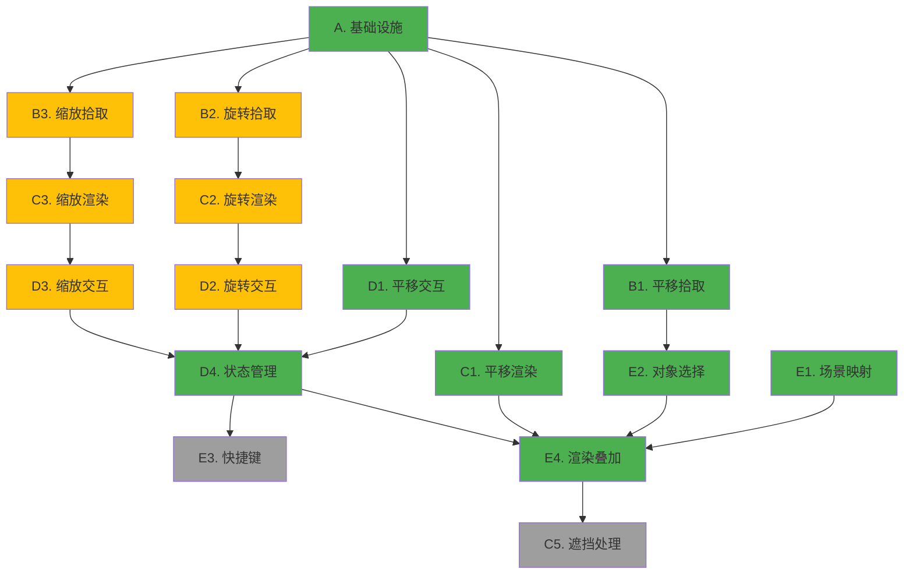

# Gizmo 系统移植计划：v0.11.0 → v0.11.1

## 项目概述

将 YuRenderLab v0.11.0 的三种 Gizmo 模式（平移/旋转/缩放）移植到 v0.11.1 的 IBL 渲染器，作为独立叠层操作康奈尔盒场景对象。采用最小依赖策略，避免完整的对象管理和 UI 系统。

### 关键决策

- **范围**：仅移植 Gizmo 内核（拾取/渲染/交互），排除对象管理系统
- **目标**：固定操作康奈尔盒的 2 个球体 + 可选的相机控制
- **集成**：Gizmo 渲染作为后处理层，不参与 IBL 计算
- **存储**：使用 buffer_d.glsl 现有相机状态存储扩展对象数据

---

## 移植模块清单（按优先级排序）

### 模块 A：基础设施层（必需）

移植 Gizmo 所需的核心数据结构和数学库。

#### A1. 数据结构定义

**源文件**：`73begonia/YuRenderLab/YuRenderLab_v0.11.0/common.glsl` (L96-109)  
**目标文件**：`73begonia/YuRenderLab/YuRenderLab_v0.11.1/common.glsl`  

**移植内容**：

```glsl
// GizmoCtx 结构体（L101-109）
struct GizmoCtx {
    vec3 pos;        // Gizmo 世界坐标
    vec4 quat;       // 旋转四元数（仅旋转/缩放模式）
    int mode;        // TRANS_TRANSLATE/ROTATE/SCALE
    int activePart;  // PART_CENTER/X/Y/Z
}

// 常量定义
// 变换模式
#define TRANS_TRANSLATE 0
#define TRANS_ROTATE 1
#define TRANS_SCALE 2

// 部件 ID
#define PART_NONE -1
#define PART_CENTER 0
#define PART_X 1
#define PART_Y 2
#define PART_Z 3

// Gizmo 尺寸常量
#define GZ_CYL_RAD 0.015      // 圆柱半径
#define GZ_CONE_LEN 0.05      // 圆锥长度
#define GZ_CONE_RAD 0.04      // 圆锥底面半径
#define GZ_CENTER_RAD 0.045   // 中心球体半径
#define GZ_RING_RAD 0.7       // 旋转圆环半径
#define GZ_RING_TUBE 0.02     // 圆环管道粗细
#define GZ_SCALE_FACTOR 0.08  // 自适应缩放系数
#define GZ_MIN_SCALE 0.5      // 最小显示尺寸
#define GZ_MAX_SCALE 2.0      // 最大显示尺寸
#define GZ_OCCLUDED_BRIGHT 0.35  // 遮挡时亮度

// 吸附参数
#define TF_SNAP_TRANS 0.25    // 平移吸附步长
#define TF_SNAP_ROT 0.2617994 // 旋转吸附（15°，PI/12）
#define TF_SNAP_SCALE 0.1     // 缩放吸附步长
#define TF_SCALE_MIN 0.1      // 最小缩放
#define TF_SCALE_MAX 5.0      // 最大缩放

// Gizmo 颜色
#define AXIS_COL_X vec3(0.9, 0.2, 0.2)  // 红色
#define AXIS_COL_Y vec3(0.2, 0.9, 0.2)  // 绿色
#define AXIS_COL_Z vec3(0.2, 0.4, 0.9)  // 蓝色
#define AXIS_COL_HL vec3(1.0, 0.9, 0.2) // 高亮黄色
```

**工作量**：50 行，1 小时  
**优先级**：✅ **必须移植**（所有模块依赖）

---

#### A2. 四元数数学库

**源文件**：`73begonia/YuRenderLab/YuRenderLab_v0.11.0/common.glsl` (L150-250)  
**目标文件**：`73begonia/YuRenderLab/YuRenderLab_v0.11.1/common.glsl`  

**移植内容**：

```glsl
// 四元数乘法
vec4 quatMul(vec4 q1, vec4 q2) {
    return vec4(
        q1.w * q2.xyz + q2.w * q1.xyz + cross(q1.xyz, q2.xyz),
        q1.w * q2.w - dot(q1.xyz, q2.xyz)
    );
}

// 四元数转旋转矩阵
mat3 quatToMat(vec4 q) {
    float xx = q.x * q.x, yy = q.y * q.y, zz = q.z * q.z;
    float xy = q.x * q.y, xz = q.x * q.z, yz = q.y * q.z;
    float wx = q.w * q.x, wy = q.w * q.y, wz = q.w * q.z;
    
    return mat3(
        1.0 - 2.0 * (yy + zz), 2.0 * (xy - wz), 2.0 * (xz + wy),
        2.0 * (xy + wz), 1.0 - 2.0 * (xx + zz), 2.0 * (yz - wx),
        2.0 * (xz - wy), 2.0 * (yz + wx), 1.0 - 2.0 * (xx + yy)
    );
}

// 轴角到四元数
vec4 axisAngleToQuat(vec3 axis, float angle) {
    float halfAngle = angle * 0.5;
    return vec4(axis * sin(halfAngle), cos(halfAngle));
}

// 获取轴向量
vec3 axisVec(int id) {
    if (id == PART_X) return vec3(1, 0, 0);
    if (id == PART_Y) return vec3(0, 1, 0);
    if (id == PART_Z) return vec3(0, 0, 1);
    return vec3(0);
}

// Gizmo 自适应缩放
float gizmoScl(vec3 c, vec3 cam) {
    return clamp(length(c - cam) * GZ_SCALE_FACTOR, GZ_MIN_SCALE, GZ_MAX_SCALE);
}

// 简单着色（定向光）
vec3 applyShade(vec3 col, vec3 n) {
    return col * (0.4 + max(dot(n, normalize(vec3(0.5, 0.8, -0.3))), 0.0) * 0.6);
}
```

**工作量**：100 行，2 小时  
**优先级**：
- ✅ **必须**：`quatToMat`、`axisVec`、`gizmoScl`、`applyShade`
- ⚠️ **旋转模式可选**：`quatMul`、`axisAngleToQuat`

---

#### A3. 解析几何求交函数

**源文件**：`73begonia/YuRenderLab/YuRenderLab_v0.11.0/common.glsl` (L486-650)  
**目标文件**：`73begonia/YuRenderLab/YuRenderLab_v0.11.1/common.glsl`  

**移植内容**：

```glsl
// 射线结构
struct Ray {
    vec3 ro;  // 起点
    vec3 rd;  // 方向（单位向量）
};

// 球体求交
bool hitSphere(vec3 ro, vec3 rd, vec3 c, float r, out float t) {
    vec3 oc = ro - c;
    float b = dot(oc, rd);
    float c2 = dot(oc, oc) - r * r;
    float h = b * b - c2;
    if (h < 0.0) return false;
    t = -b - sqrt(h);
    return t > 0.0;
}

// 无限圆柱求交
bool hitCylinder(vec3 ro, vec3 rd, vec3 pA, vec3 pB, float r, out float t) {
    vec3 ba = pB - pA;
    vec3 oc = ro - pA;
    
    float baba = dot(ba, ba);
    float bard = dot(ba, rd);
    float baoc = dot(ba, oc);
    
    float k2 = baba - bard * bard;
    float k1 = baba * dot(oc, rd) - baoc * bard;
    float k0 = baba * dot(oc, oc) - baoc * baoc - r * r * baba;
    
    float h = k1 * k1 - k2 * k0;
    if (h < 0.0) return false;
    
    t = (-k1 - sqrt(h)) / k2;
    
    // 检查交点是否在圆柱段内
    float y = baoc + t * bard;
    if (y < 0.0 || y > baba) return false;
    
    return t > 0.0;
}

// 圆锥求交
bool hitCone(vec3 ro, vec3 rd, vec3 c, vec3 n, float h, float r, out float t) {
    vec3 co = ro - c;
    
    float cosa = h / sqrt(h * h + r * r);
    float cosa2 = cosa * cosa;
    
    float codr = dot(co, rd);
    float codo = dot(co, co);
    
    float a = dot(rd, n) * dot(rd, n) - cosa2;
    float b = 2.0 * (dot(rd, n) * dot(co, n) - codr * cosa2);
    float c2 = dot(co, n) * dot(co, n) - codo * cosa2;
    
    float det = b * b - 4.0 * a * c2;
    if (det < 0.0) return false;
    
    float t1 = (-b - sqrt(det)) / (2.0 * a);
    float t2 = (-b + sqrt(det)) / (2.0 * a);
    
    t = t1;
    vec3 p = ro + t * rd;
    float y = dot(p - c, n);
    if (y < 0.0 || y > h) {
        t = t2;
        p = ro + t * rd;
        y = dot(p - c, n);
        if (y < 0.0 || y > h) return false;
    }
    
    return t > 0.0;
}

// 圆盘求交（旋转 Gizmo 用）
bool hitDisk(vec3 ro, vec3 rd, vec3 c, vec3 axis, float rad, float th, out float t) {
    float denom = dot(rd, axis);
    if (abs(denom) < 0.0001) return false;
    
    t = dot(c - ro, axis) / denom;
    if (t < 0.0) return false;
    
    vec3 p = ro + t * rd;
    float dist = length(p - c);
    
    return dist >= rad - th && dist <= rad + th;
}

// 立方体求交（缩放 Gizmo 用）
bool hitBox(vec3 ro, vec3 rd, vec3 c, vec3 size, out float t) {
    vec3 m = 1.0 / rd;
    vec3 n = m * (ro - c);
    vec3 k = abs(m) * size;
    
    vec3 t1 = -n - k;
    vec3 t2 = -n + k;
    
    float tN = max(max(t1.x, t1.y), t1.z);
    float tF = min(min(t2.x, t2.y), t2.z);
    
    if (tN > tF || tF < 0.0) return false;
    
    t = tN > 0.0 ? tN : tF;
    return true;
}
```

**工作量**：200 行，3 小时  
**优先级**：
- ✅ **平移**：`hitSphere`、`hitCylinder`、`hitCone`
- ⚠️ **旋转**：加上 `hitDisk`
- ⚠️ **缩放**：加上 `hitBox`

---

### 模块 B：Gizmo 拾取系统（核心）

处理鼠标点击射线与 Gizmo 几何体的交互检测。

#### B1. 平移 Gizmo 拾取

**源文件**：`73begonia/YuRenderLab/YuRenderLab_v0.11.0/common.glsl` (L948-989)  
**目标文件**：`73begonia/YuRenderLab/YuRenderLab_v0.11.1/common.glsl`  

**功能说明**：
- 遍历中心球 + 三个轴向圆柱 + 三个圆锥箭头
- 计算射线与每个几何体的最近交点
- 返回最近命中部件（`PART_CENTER`/`X`/`Y`/`Z`）

**函数原型**：

```glsl
int pickAxisGizmo(Ray r, vec3 c, float sc, mat3 axT, out float ht) {
    // r: 相机射线
    // c: Gizmo 中心位置
    // sc: 自适应缩放系数
    // axT: 轴变换矩阵（单位矩阵用于平移，局部坐标系用于缩放）
    // ht: 输出最近交点距离
    // 返回: PART_CENTER/X/Y/Z/NONE
}
```

**实现要点**：
1. 检测中心球体（半径 `GZ_CENTER_RAD * sc`）
2. 对每个轴（X/Y/Z）：
   - 检测圆柱段（从中心到箭头起点）
   - 检测圆锥箭头
3. 深度排序，返回最近命中

**工作量**：80 行，3 小时  
**优先级**：✅ **必须**（平移模式核心）

---

#### B2. 旋转 Gizmo 拾取

**源文件**：`73begonia/YuRenderLab/YuRenderLab_v0.11.0/common.glsl` (L991-1033)  
**目标文件**：`73begonia/YuRenderLab/YuRenderLab_v0.11.1/common.glsl`  

**功能说明**：
- 计算三个圆环（XY/YZ/XZ 平面）的射线交点
- 使用 `getArcQuad()` 仅拾取面向相机的圆弧段
- 深度排序解决遮挡

**函数原型**：

```glsl
int pickRotGizmo(Ray r, vec3 c, vec3 cam, float sc, int actPart, out float ht) {
    // r: 相机射线
    // c: Gizmo 中心位置
    // cam: 相机位置
    // sc: 自适应缩放系数
    // actPart: 当前活动部件（用于高亮）
    // ht: 输出最近交点距离
    // 返回: PART_X/Y/Z/NONE
}
```

**辅助函数**：

```glsl
// 计算圆弧的前向可见象限
vec4 getArcQuad(vec3 c, vec3 axis, vec3 cam) {
    // 返回 vec4(startAngle, endAngle, cosStart, cosEnd)
    // 仅绘制面向相机的 180° 圆弧
}
```

**工作量**：120 行，4 小时  
**优先级**：⚠️ **可选**（若只需平移/缩放可跳过，节省 30% 工作量）

---

#### B3. 缩放 Gizmo 拾取

**源文件**：`73begonia/YuRenderLab/YuRenderLab_v0.11.0/common.glsl` (L948-989)  
**目标文件**：`73begonia/YuRenderLab/YuRenderLab_v0.11.1/common.glsl`  

**功能说明**：
- 复用 `pickAxisGizmo`，但轴端使用立方体替代圆锥
- 使用物体局部坐标系（通过 `quatToMat(ctx.quat)` 获得）

**实现要点**：
1. 将射线变换到物体局部空间：
   ```glsl
   mat3 localMat = quatToMat(ctx.quat);
   vec3 localRo = (r.ro - c) * localMat;
   vec3 localRd = r.rd * localMat;
   ```
2. 轴端立方体尺寸：`GZ_CONE_RAD * 0.7`

**工作量**：50 行（复用平移逻辑），2 小时  
**优先级**：⚠️ **中等优先级**

---

#### B4. 统一拾取接口

**目标文件**：`73begonia/YuRenderLab/YuRenderLab_v0.11.1/common.glsl`  

**函数原型**：

```glsl
int pickGizmo(Ray r, GizmoCtx ctx, vec3 cam, out float ht) {
    if (ctx.mode == TRANS_TRANSLATE) {
        return pickAxisGizmo(r, ctx.pos, gizmoScl(ctx.pos, cam), mat3(1.0), ht);
    } else if (ctx.mode == TRANS_ROTATE) {
        return pickRotGizmo(r, ctx.pos, cam, gizmoScl(ctx.pos, cam), ctx.activePart, ht);
    } else if (ctx.mode == TRANS_SCALE) {
        mat3 axT = quatToMat(ctx.quat);
        return pickAxisGizmo(r, ctx.pos, gizmoScl(ctx.pos, cam), axT, ht);
    }
    return PART_NONE;
}
```

**工作量**：20 行，0.5 小时  
**优先级**：✅ **必须**

---

### 模块 C：Gizmo 渲染系统（视觉呈现）

生成 Gizmo 的解析几何渲染结果。

#### C1. 平移 Gizmo 渲染

**源文件**：`73begonia/YuRenderLab/YuRenderLab_v0.11.0/common.glsl` (L1086-1160)  
**目标文件**：`73begonia/YuRenderLab/YuRenderLab_v0.11.1/common.glsl`  

**渲染组件**：
1. 中心球体（半径 `GZ_CENTER_RAD * scale`）
2. 三根轴向圆柱（RGB 颜色）
3. 三个圆锥箭头（指向 +X/+Y/+Z）

**函数原型**：

```glsl
struct TraceResult {
    bool hit;
    float t;
    vec3 color;
    vec3 normal;
};

void traceAxisGizmo(Ray r, vec3 c, float sc, mat3 axT, int actPart, inout TraceResult res) {
    // 遍历所有组件，找到最近交点
    // 应用着色和高亮
    // 更新 res
}
```

**着色特性**：
- 活动部件显示高亮色（`AXIS_COL_HL`）
- 简单定向光照（`applyShade()`）
- 软边缘抗锯齿（距离场 `smoothstep`）

**工作量**：150 行，4 小时  
**优先级**：✅ **必须**（视觉核心）

---

#### C2. 旋转 Gizmo 渲染

**源文件**：`73begonia/YuRenderLab/YuRenderLab_v0.11.0/common.glsl` (L1162-1197)  
**目标文件**：`73begonia/YuRenderLab/YuRenderLab_v0.11.1/common.glsl`  

**渲染组件**：
- 三个圆环（X/Y/Z 轴平面）
- 管道粗细：`GZ_RING_TUBE * scale`
- 前向可见性裁剪（仅显示面向相机的圆弧段）

**函数原型**：

```glsl
void traceRotGizmo(Ray r, vec3 c, vec3 cam, float sc, int actPart, inout TraceResult res) {
    // 对每个圆环：
    //   1. 计算与环平面的交点
    //   2. 检查是否在前向可见弧段内
    //   3. 计算到管道中心线的距离
    //   4. 软边缘渲染
}
```

**圆环距离场**：

```glsl
float torusDist(vec3 p, vec2 t) {
    vec2 q = vec2(length(p.xz) - t.x, p.y);
    return length(q) - t.y;
}
```

**工作量**：100 行，3 小时  
**优先级**：⚠️ **可选**（与拾取同步）

---

#### C3. 缩放 Gizmo 渲染

**源文件**：`73begonia/YuRenderLab/YuRenderLab_v0.11.0/common.glsl` (L1086-1160)  
**目标文件**：`73begonia/YuRenderLab/YuRenderLab_v0.11.1/common.glsl`  

**变体**：复用 `traceAxisGizmo`，但：
- 轴端改为立方体（使用 `sdfBox`）
- 使用物体局部坐标系

**立方体距离场**：

```glsl
float sdfBox(vec3 p, vec3 b) {
    vec3 q = abs(p) - b;
    return length(max(q, 0.0)) + min(max(q.x, max(q.y, q.z)), 0.0);
}
```

**工作量**：60 行（复用），2 小时  
**优先级**：⚠️ **中等优先级**

---

#### C4. 统一渲染接口

**目标文件**：`73begonia/YuRenderLab/YuRenderLab_v0.11.1/common.glsl`  

**函数原型**：

```glsl
void traceGizmo(Ray r, GizmoCtx ctx, vec3 cam, inout TraceResult res) {
    float sc = gizmoScl(ctx.pos, cam);
    
    if (ctx.mode == TRANS_TRANSLATE) {
        traceAxisGizmo(r, ctx.pos, sc, mat3(1.0), ctx.activePart, res);
    } else if (ctx.mode == TRANS_ROTATE) {
        traceRotGizmo(r, ctx.pos, cam, sc, ctx.activePart, res);
    } else if (ctx.mode == TRANS_SCALE) {
        mat3 axT = quatToMat(ctx.quat);
        traceAxisGizmo(r, ctx.pos, sc, axT, ctx.activePart, res);
    }
}
```

**工作量**：20 行，0.5 小时  
**优先级**：✅ **必须**

---

#### C5. 遮挡处理与深度排序

**源文件**：`73begonia/YuRenderLab/YuRenderLab_v0.11.0/image.glsl` (L142-148)  
**目标文件**：`73begonia/YuRenderLab/YuRenderLab_v0.11.1/image.glsl`  

**实现逻辑**：

```glsl
// 在主渲染循环中
TraceResult gizmoRes;
traceGizmo(ray, ctx, camPos, gizmoRes);

if (gizmoRes.hit) {
    if (gizmoRes.t < sceneDepth) {
        // Gizmo 在前，完全覆盖
        fragColor = vec4(gizmoRes.color, 1.0);
    } else {
        // Gizmo 被遮挡，降低亮度
        vec3 occludedColor = gizmoRes.color * GZ_OCCLUDED_BRIGHT;
        fragColor = vec4(mix(sceneColor, occludedColor, 0.5), 1.0);
    }
}
```

**工作量**：30 行，1 小时  
**优先级**：⚠️ **可选**（视觉增强，非必需）

---

### 模块 D：交互逻辑（行为控制）

处理鼠标拖拽转换为对象变换。

#### D1. 平移交互

**源文件**：`73begonia/YuRenderLab/YuRenderLab_v0.11.0/buffer_d.glsl` (L254-265)  
**目标文件**：`73begonia/YuRenderLab/YuRenderLab_v0.11.1/buffer_d.glsl`  

**交互逻辑**：

```glsl
void procTranslateInp(inout GizmoCtx ctx, Ray dragRay, Ray dragStart, vec3 camForward, bool ctrlKey) {
    vec3 delta = vec3(0.0);
    
    if (ctx.activePart >= PART_X && ctx.activePart <= PART_Z) {
        // 沿轴向约束移动
        vec3 axis = axisVec(ctx.activePart);
        float t = calcAxisDelta(dragRay, dragStart, ctx.pos, axis);
        delta = axis * t;
    } else if (ctx.activePart == PART_CENTER) {
        // 沿相机视平面移动
        delta = calcPlaneDelta(dragRay, dragStart, ctx.pos, camForward);
    }
    
    // Ctrl 吸附
    if (ctrlKey) {
        delta = round(delta / TF_SNAP_TRANS) * TF_SNAP_TRANS;
    }
    
    ctx.pos += delta;
}
```

**辅助函数**：

```glsl
// 计算轴向投影位移
float calcAxisDelta(Ray current, Ray start, vec3 gizmoPos, vec3 axis) {
    // 将拖拽起点和当前点投影到轴上
    vec3 startProj = projectToAxis(start, gizmoPos, axis);
    vec3 currProj = projectToAxis(current, gizmoPos, axis);
    return dot(currProj - startProj, axis);
}

// 将射线投影到轴上
vec3 projectToAxis(Ray r, vec3 origin, vec3 axis) {
    // 找到射线上最接近轴线的点
    vec3 w = r.ro - origin;
    float a = dot(r.rd, axis);
    float b = dot(w, axis);
    float t = (b - a * dot(w, r.rd)) / (1.0 - a * a);
    vec3 p = r.ro + t * r.rd;
    return origin + axis * dot(p - origin, axis);
}

// 计算视平面位移
vec3 calcPlaneDelta(Ray current, Ray start, vec3 gizmoPos, vec3 camForward) {
    // 将射线与垂直相机的平面求交
    float tStart = dot(gizmoPos - start.ro, camForward) / dot(start.rd, camForward);
    float tCurr = dot(gizmoPos - current.ro, camForward) / dot(current.rd, camForward);
    
    vec3 pStart = start.ro + tStart * start.rd;
    vec3 pCurr = current.ro + tCurr * current.rd;
    
    return pCurr - pStart;
}
```

**工作量**：100 行，3 小时  
**优先级**：✅ **必须**（核心交互）

---

#### D2. 旋转交互

**源文件**：`73begonia/YuRenderLab/YuRenderLab_v0.11.0/buffer_d.glsl` (L266-278)  
**目标文件**：`73begonia/YuRenderLab/YuRenderLab_v0.11.1/buffer_d.glsl`  

**交互逻辑**：

```glsl
void procRotateInp(inout GizmoCtx ctx, Ray dragRay, Ray dragStart, vec2 mouseDelta, bool ctrlKey) {
    if (ctx.activePart >= PART_X && ctx.activePart <= PART_Z) {
        // 沿轴向旋转
        vec3 axis = axisVec(ctx.activePart);
        float angle = calcRotAngle(dragStart, dragRay, ctx.pos, axis);
        
        // Ctrl 吸附
        if (ctrlKey) {
            angle = round(angle / TF_SNAP_ROT) * TF_SNAP_ROT;
        }
        
        vec4 deltaQuat = axisAngleToQuat(axis, angle);
        ctx.quat = quatMul(deltaQuat, ctx.quatOrig);
        
    } else if (ctx.activePart == PART_CENTER) {
        // 自由视觉旋转（屏幕空间）
        vec4 screenQuat = calcScreenRotQuat(mouseDelta);
        ctx.quat = quatMul(screenQuat, ctx.quatOrig);
    }
}
```

**辅助函数**：

```glsl
// 计算旋转角度（基于圆周投影）
float calcRotAngle(Ray start, Ray current, vec3 center, vec3 axis) {
    // 1. 将射线与旋转平面求交
    vec3 pStart = intersectPlane(start, center, axis);
    vec3 pCurr = intersectPlane(current, center, axis);
    
    // 2. 计算相对中心的向量
    vec3 vStart = normalize(pStart - center);
    vec3 vCurr = normalize(pCurr - center);
    
    // 3. 计算夹角
    float cosAngle = dot(vStart, vCurr);
    float sinAngle = dot(cross(vStart, vCurr), axis);
    
    return atan(sinAngle, cosAngle);
}

// 屏幕空间旋转四元数
vec4 calcScreenRotQuat(vec2 delta) {
    float angle = length(delta) * 0.01;
    vec3 axis = normalize(vec3(-delta.y, delta.x, 0.0));
    return axisAngleToQuat(axis, angle);
}
```

**工作量**：150 行，5 小时  
**优先级**：⚠️ **高复杂度**（可先跳过，优先完成平移/缩放）

---

#### D3. 缩放交互

**源文件**：`73begonia/YuRenderLab/YuRenderLab_v0.11.0/buffer_d.glsl` (L279-290)  
**目标文件**：`73begonia/YuRenderLab/YuRenderLab_v0.11.1/buffer_d.glsl`  

**交互逻辑**：

```glsl
void procScaleInp(inout vec3 objScale, GizmoCtx ctx, Ray dragRay, Ray dragStart, vec3 objPos, bool ctrlKey) {
    // 计算拖拽起点和当前点到物体的距离比
    float distStart = length(getClosestPoint(dragStart, objPos) - objPos);
    float distCurr = length(getClosestPoint(dragRay, objPos) - objPos);
    float scaleDelta = distCurr / distStart;
    
    if (ctx.activePart >= PART_X && ctx.activePart <= PART_Z) {
        // 单轴缩放
        objScale[ctx.activePart] *= scaleDelta;
    } else {
        // 统一缩放
        objScale *= vec3(scaleDelta);
    }
    
    // Ctrl 吸附
    if (ctrlKey) {
        objScale = round(objScale / TF_SNAP_SCALE) * TF_SNAP_SCALE;
    }
    
    // 范围限制
    objScale = clamp(objScale, vec3(TF_SCALE_MIN), vec3(TF_SCALE_MAX));
}
```

**辅助函数**：

```glsl
// 获取射线上最接近点的位置
vec3 getClosestPoint(Ray r, vec3 p) {
    float t = dot(p - r.ro, r.rd);
    return r.ro + max(t, 0.0) * r.rd;
}
```

**工作量**：80 行，2 小时  
**优先级**：⚠️ **中等优先级**

---

#### D4. 状态管理

**源文件**：`73begonia/YuRenderLab/YuRenderLab_v0.11.0/buffer_d.glsl` (L600-700)  
**目标文件**：扩展 `73begonia/YuRenderLab/YuRenderLab_v0.11.1/buffer_d.glsl` (L50-80)  

**存储布局**：

```glsl
// Buffer D 纹理布局（扩展现有设计）
// Y=0（控制行）：
//   X=0: vec4(selectedID, gizmoMode, isDragging, activePart)
//   X=1: vec4(dragStartU, dragStartV, mouseU, mouseV)
//   X=2: vec4(ctrlKey, shiftKey, altKey, -)

// Y=1（球体1数据）：
//   X=0: vec4(pos.xyz, scale)
//   X=1: vec4(quat.xyzw)
//   X=2: vec4(color.rgb, -)

// Y=2（球体2数据）：
//   X=0: vec4(pos.xyz, scale)
//   X=1: vec4(quat.xyzw)
//   X=2: vec4(color.rgb, -)
```

**读写函数**：

```glsl
// 加载控制状态
vec4 loadControlState() {
    return texelFetch(iChannel0, ivec2(0, 0), 0);
}

// 保存控制状态
void saveControlState(int selID, int mode, bool drag, int part) {
    if (fragCoord.y == 0.0 && fragCoord.x == 0.0) {
        fragColor = vec4(float(selID), float(mode), drag ? 1.0 : 0.0, float(part));
    }
}

// 加载对象数据
struct ObjData {
    vec3 pos;
    float scale;
    vec4 quat;
    vec3 color;
};

ObjData loadObj(int id) {
    ObjData obj;
    vec4 d0 = texelFetch(iChannel0, ivec2(0, id), 0);
    vec4 d1 = texelFetch(iChannel0, ivec2(1, id), 0);
    vec4 d2 = texelFetch(iChannel0, ivec2(2, id), 0);
    
    obj.pos = d0.xyz;
    obj.scale = d0.w;
    obj.quat = d1;
    obj.color = d2.rgb;
    
    return obj;
}

// 保存对象数据
void saveObj(int id, ObjData obj, vec2 fragCoord) {
    if (fragCoord.y == float(id)) {
        if (fragCoord.x == 0.0) {
            fragColor = vec4(obj.pos, obj.scale);
        } else if (fragCoord.x == 1.0) {
            fragColor = obj.quat;
        } else if (fragCoord.x == 2.0) {
            fragColor = vec4(obj.color, 0.0);
        }
    }
}
```

**工作量**：120 行，3 小时  
**优先级**：✅ **必须**（数据持久化核心）

---

### 模块 E：场景集成（适配 v0.11.1）

#### E1. 康奈尔盒对象映射

**目标文件**：`73begonia/YuRenderLab/YuRenderLab_v0.11.1/common.glsl` 和 `image.glsl`  

**修改场景函数**：

```glsl
// 扩展现有 scene() 函数，使其读取动态对象数据
vec2 scene(vec3 p, sampler2D bufD) {
    vec2 res = vec2(1e10, 0.0);
    
    // 静态几何（墙面、光源）
    res = opU(res, vec2(sdBox(p - vec3(0,1,0), vec3(1,1,1)), MAT_WALLS));
    
    // 动态球体1
    ObjData obj1 = loadObj(1, bufD);
    float d1 = length(p - obj1.pos) - obj1.scale;
    res = opU(res, vec2(d1, MAT_SPHERE1));
    
    // 动态球体2
    ObjData obj2 = loadObj(2, bufD);
    float d2 = length(p - obj2.pos) - obj2.scale;
    res = opU(res, vec2(d2, MAT_SPHERE2));
    
    return res;
}
```

**材质 ID 定义**：

```glsl
#define MAT_WALLS 0.0
#define MAT_SPHERE1 1.0
#define MAT_SPHERE2 2.0
#define MAT_LIGHT 3.0
```

**工作量**：100 行，2 小时  
**优先级**：✅ **必须**（连接 Gizmo 与场景）

---

#### E2. 对象选择系统

**源文件**：参考 `73begonia/YuRenderLab/YuRenderLab_v0.11.0/buffer_d.glsl` (L400-450)  
**目标文件**：`73begonia/YuRenderLab/YuRenderLab_v0.11.1/buffer_d.glsl`  

**选择逻辑**：

```glsl
void procSelectionInp(inout int selectedID, vec2 mousePos, bool mouseClick) {
    if (mouseClick && !isDragging) {
        Ray ray = getCameraRay(mousePos);
        
        // 追踪场景
        float t;
        vec2 res = rayMarch(ray, t);
        float mat = res.y;
        
        // 根据材质 ID 确定选中对象
        if (mat == MAT_SPHERE1) {
            selectedID = 1;
        } else if (mat == MAT_SPHERE2) {
            selectedID = 2;
        } else {
            selectedID = 0;  // 取消选择
        }
    }
}
```

**需要修改**：确保场景追踪返回材质 ID（当前 v0.11.1 可能仅返回 PBR 参数）

**工作量**：80 行，2 小时  
**优先级**：✅ **必须**（Gizmo 需要知道操作哪个对象）

---

#### E3. 快捷键系统

**目标文件**：`73begonia/YuRenderLab/YuRenderLab_v0.11.1/buffer_d.glsl`  

**键盘输入处理**：

```glsl
void procKeyboardInp(inout int gizmoMode, inout vec3 camPos, int selectedID) {
    // Gizmo 模式切换
    if (keyPressed(KEY_W)) {
        gizmoMode = TRANS_TRANSLATE;
    }
    if (keyPressed(KEY_E)) {
        gizmoMode = TRANS_ROTATE;
    }
    if (keyPressed(KEY_R)) {
        gizmoMode = TRANS_SCALE;
    }
    
    // 聚焦选中对象
    if (keyPressed(KEY_F) && selectedID > 0) {
        ObjData obj = loadObj(selectedID);
        // 相机平滑移动到对象附近
        vec3 targetPos = obj.pos + vec3(0, 0, -3);
        camPos = mix(camPos, targetPos, 0.1);
    }
}

// 辅助函数：检测按键（Shadertoy 键盘纹理）
bool keyPressed(int key) {
    return texelFetch(iChannel1, ivec2(key, 0), 0).x > 0.5;
}

// 按键码（ASCII）
#define KEY_W 87
#define KEY_E 69
#define KEY_R 82
#define KEY_F 70
```

**工作量**：50 行，1 小时  
**优先级**：⚠️ **可选**（可用鼠标点击 UI 按钮替代）

---

#### E4. Gizmo 渲染叠加

**目标文件**：`73begonia/YuRenderLab/YuRenderLab_v0.11.1/image.glsl` (L300+)  

**主渲染循环修改**：

```glsl
void mainImage(out vec4 fragColor, in vec2 fragCoord) {
    vec2 uv = fragCoord / iResolution.xy;
    
    // 1. 加载状态
    vec4 ctrlState = loadControlState();
    int selectedID = int(ctrlState.x);
    int gizmoMode = int(ctrlState.y);
    
    // 2. 生成相机射线
    Ray ray = getCameraRay(uv);
    
    // 3. 现有 IBL 渲染（保持不变）
    float sceneDepth;
    vec3 col = renderPBR(ray, sceneDepth);
    
    // 4. Gizmo 叠加层（新增）
    if (selectedID > 0) {
        // 加载 Gizmo 上下文
        ObjData obj = loadObj(selectedID);
        GizmoCtx ctx;
        ctx.pos = obj.pos;
        ctx.quat = obj.quat;
        ctx.mode = gizmoMode;
        ctx.activePart = int(ctrlState.w);
        
        // 渲染 Gizmo
        TraceResult gizmoRes;
        gizmoRes.hit = false;
        traceGizmo(ray, ctx, cameraPos, gizmoRes);
        
        if (gizmoRes.hit) {
            if (gizmoRes.t < sceneDepth) {
                // Gizmo 在前，完全覆盖
                col = gizmoRes.color;
            } else {
                // Gizmo 被遮挡，半透明叠加
                col = mix(col, gizmoRes.color * GZ_OCCLUDED_BRIGHT, 0.4);
            }
        }
    }
    
    // 5. 输出
    fragColor = vec4(col, 1.0);
}
```

**工作量**：40 行，1 小时  
**优先级**：✅ **必须**（显示 Gizmo）

---

## 总工作量估算

### 完整功能（三种模式）

| 模块 | 行数 | 时间 | 优先级 |
|-----|------|------|--------|
| **A. 基础设施** | 350 | 6h | ✅ 必须 |
| **B1. 平移拾取** | 80 | 3h | ✅ 必须 |
| **B2. 旋转拾取** | 120 | 4h | ⚠️ 可选 |
| **B3. 缩放拾取** | 50 | 2h | ⚠️ 可选 |
| **B4. 统一拾取** | 20 | 0.5h | ✅ 必须 |
| **C1. 平移渲染** | 150 | 4h | ✅ 必须 |
| **C2. 旋转渲染** | 100 | 3h | ⚠️ 可选 |
| **C3. 缩放渲染** | 60 | 2h | ⚠️ 可选 |
| **C4. 统一渲染** | 20 | 0.5h | ✅ 必须 |
| **C5. 遮挡处理** | 30 | 1h | ⚠️ 可选 |
| **D1. 平移交互** | 100 | 3h | ✅ 必须 |
| **D2. 旋转交互** | 150 | 5h | ⚠️ 可选 |
| **D3. 缩放交互** | 80 | 2h | ⚠️ 可选 |
| **D4. 状态管理** | 120 | 3h | ✅ 必须 |
| **E1. 场景映射** | 100 | 2h | ✅ 必须 |
| **E2. 对象选择** | 80 | 2h | ✅ 必须 |
| **E3. 快捷键** | 50 | 1h | ⚠️ 可选 |
| **E4. 渲染叠加** | 40 | 1h | ✅ 必须 |
| **总计（全部）** | **1700** | **45h** | - |

### 最小实现（仅平移模式）

| 模块 | 行数 | 时间 |
|-----|------|------|
| A. 基础设施（部分） | 250 | 4h |
| B1. 平移拾取 | 80 | 3h |
| B4. 统一拾取（简化） | 10 | 0.5h |
| C1. 平移渲染 | 150 | 4h |
| C4. 统一渲染（简化） | 10 | 0.5h |
| D1. 平移交互 | 100 | 3h |
| D4. 状态管理 | 120 | 3h |
| E1. 场景映射 | 100 | 2h |
| E2. 对象选择 | 80 | 2h |
| E4. 渲染叠加 | 40 | 1h |
| **总计（最小）** | **940** | **23h** |

---

## 推荐实施策略

### **阶段 1：核心平移功能**（1-2 天，23 小时）

**目标**：可用鼠标拖拽康奈尔盒的 2 个球体沿 XYZ 轴平移

**移植模块**：
- A1, A2（部分），A3（部分）：基础设施
- B1, B4（简化）：平移拾取
- C1, C4（简化）：平移渲染
- D1, D4：平移交互 + 状态管理
- E1, E2, E4：场景集成

**验证标准**：
1. ✅ 点击白色球体显示平移 Gizmo（三轴箭头 + 中心球）
2. ✅ 拖拽红色 X 轴，球体仅沿 X 轴移动
3. ✅ 拖拽中心球，球体沿视平面移动
4. ✅ 按住 Ctrl 拖拽，位置吸附到 0.25 单位网格
5. ✅ 旋转相机，Gizmo 保持屏幕空间恒定大小

---

### **阶段 2：完整三模式**（+1-2 天，22 小时）

**目标**：支持旋转和缩放操作

**追加模块**：
- A2（完整），A3（完整）：四元数 + 完整几何求交
- B2, B3：旋转/缩放拾取
- C2, C3：旋转/缩放渲染
- D2, D3：旋转/缩放交互

**验证标准**：
1. ✅ 按 `E` 切换到旋转模式，显示三轴圆环
2. ✅ 拖拽蓝色 Z 环，球体绕 Z 轴旋转
3. ✅ 按 `R` 切换到缩放模式，轴端显示立方体
4. ✅ 拖拽绿色 Y 轴立方体，球体仅沿 Y 轴拉伸

---

### **阶段 3：视觉优化**（+0.5 天，2 小时）

**目标**：专业级交互体验

**追加模块**：
- C5：遮挡处理（被墙面遮挡时变暗）
- E3：快捷键系统（W/E/R 模式切换，F 聚焦）

**验证标准**：
1. ✅ Gizmo 被墙面遮挡时显示半透明暗色
2. ✅ 按 `F` 相机平滑移动到选中对象附近

---

## 潜在风险与注意事项

### 1. **坐标系差异**
- **风险**：v0.11.1 的相机系统可能与 v0.11.0 不兼容（Y-up vs Z-up）
- **缓解**：在阶段 1 开始前验证射线生成函数的一致性
- **测试**：点击场景中心应精确命中地面原点

### 2. **性能影响**
- **风险**：Gizmo 解析几何求交增加 10-20% GPU 开销
- **缓解**：
  - 仅在选中对象时渲染 Gizmo
  - 限制最大追踪距离（`gizmoRes.t < 5.0`）
  - 简化圆环几何（降低采样精度）
- **测试**：在低端 GPU 上保持 60 FPS

### 3. **状态存储冲突**
- **风险**：Buffer D 现有布局可能不足（仅 127 行）
- **缓解**：
  - 压缩数据（使用整数编码枚举）
  - 仅存储活动对象数据
  - 移除非必需的历史状态
- **验证**：打印 Buffer D 纹理确认数据正确写入

### 4. **旋转交互复杂度**
- **风险**：`calcRotAngle` 函数涉及复杂的几何投影，易出错
- **缓解**：
  - 先实现平移/缩放，验证架构正确性
  - 参考 v0.11.0 的精确实现（逐行移植）
  - 增加调试可视化（显示投影点）
- **回退方案**：暂时仅支持屏幕空间自由旋转（`PART_CENTER`）

### 5. **场景 SDF 修改**
- **风险**：v0.11.1 的 IBL 渲染可能假设静态场景（预计算加速结构）
- **缓解**：
  - 保持墙面/光源静态
  - 仅球体使用动态数据
  - 确保 SDF 函数每帧重新计算
- **测试**：移动球体后 IBL 反射应实时更新

---

## 依赖关系图



**图例**：
- 🟢 绿色：阶段 1 核心模块（必须）
- 🟡 黄色：阶段 2 扩展模块（可选）
- ⚪ 灰色：阶段 3 优化模块（可选）

---

## 下一步行动

### **决策点**

请选择实施路径：

#### **选项 A：渐进式开发**（推荐）
1. 从阶段 1 开始（仅平移，23h）
2. 验证架构可行性后再进入阶段 2
3. 适合初次移植、不确定性高的场景

#### **选项 B：完整实现**
1. 直接实现全部三种模式（45h）
2. 适合明确需求、时间充裕的场景

#### **选项 C：自定义组合**
1. 根据具体需求调整模块优先级
2. 例如：仅实现平移 + 缩放（跳过旋转，节省 9h）

---

### **开始前准备**

#### **1. 环境设置**
- 确认 v0.11.1 可正常运行
- 备份原始文件（创建 `v0.11.1_backup` 文件夹）
- 设置版本控制（Git 仓库）

#### **2. 工具准备**
- Shadertoy 账号（用于测试）
- 文本编辑器（VSCode + GLSL 插件）
- GPU 性能监测工具（如 RenderDoc）

#### **3. 参考材料**
- v0.11.0 完整源码（标注关键行号）
- 本移植计划文档
- Gizmo 交互参考视频/截图

---

## 附录

### A. 关键文件对照表

| 功能 | v0.11.0 位置 | v0.11.1 目标 |
|-----|-------------|-------------|
| Gizmo 数据结构 | common.glsl L96-109 | common.glsl（新增） |
| 四元数库 | common.glsl L150-250 | common.glsl（新增） |
| 几何求交 | common.glsl L486-650 | common.glsl（新增） |
| Gizmo 拾取 | common.glsl L948-1033 | common.glsl（新增） |
| Gizmo 渲染 | common.glsl L1039-1271 | common.glsl（新增） |
| 交互逻辑 | buffer_d.glsl L224-326 | buffer_d.glsl（扩展） |
| 状态存储 | buffer_d.glsl L600-700 | buffer_d.glsl（扩展） |
| 场景 SDF | image.glsl L50-150 | image.glsl（修改） |
| 渲染合成 | image.glsl L300-400 | image.glsl（扩展） |

### B. 测试用例清单

#### **阶段 1 测试**
- [ ] T1.1：点击球体 1 → 显示平移 Gizmo
- [ ] T1.2：点击球体 2 → 切换选择
- [ ] T1.3：点击空白处 → 取消选择，隐藏 Gizmo
- [ ] T1.4：拖拽 X 轴 → 仅 X 坐标变化
- [ ] T1.5：拖拽 Y 轴 → 仅 Y 坐标变化
- [ ] T1.6：拖拽 Z 轴 → 仅 Z 坐标变化
- [ ] T1.7：拖拽中心球 → 沿视平面移动
- [ ] T1.8：Ctrl + 拖拽 → 吸附到 0.25 网格
- [ ] T1.9：旋转相机 → Gizmo 尺寸保持恒定
- [ ] T1.10：球体移动后 → IBL 反射实时更新

#### **阶段 2 测试**
- [ ] T2.1：按 `E` → 切换到旋转模式
- [ ] T2.2：拖拽 X 环 → 绕 X 轴旋转
- [ ] T2.3：Ctrl + 拖拽环 → 吸附到 15°
- [ ] T2.4：按 `R` → 切换到缩放模式
- [ ] T2.5：拖拽 Y 轴立方体 → 仅 Y 方向拉伸
- [ ] T2.6：拖拽中心球 → 统一缩放
- [ ] T2.7：Ctrl + 缩放 → 吸附到 0.1 倍数
- [ ] T2.8：缩放到边界 → 限制在 [0.1, 5.0]

#### **阶段 3 测试**
- [ ] T3.1：Gizmo 被墙遮挡 → 显示暗色半透明
- [ ] T3.2：按 `F` → 相机平滑移动到对象
- [ ] T3.3：快捷键 W/E/R → 模式快速切换

### C. 常见问题排查

#### **问题 1：Gizmo 不显示**
- 检查 `selectedID > 0`
- 验证 `traceGizmo` 返回 `hit = true`
- 确认 `gizmoRes.t < sceneDepth`（深度测试）

#### **问题 2：拖拽无响应**
- 检查 `isDragging` 状态正确设置
- 验证 `dragStart` 射线正确存储
- 确认 `procTranslateInp` 函数被调用

#### **问题 3：Gizmo 尺寸异常**
- 检查 `gizmoScl` 返回值
- 验证相机位置 `camPos` 正确传递
- 确认常量 `GZ_SCALE_FACTOR` 合理

#### **问题 4：旋转不正确**
- 打印四元数值（应保持单位化，`length(quat) ≈ 1`）
- 验证 `calcRotAngle` 使用正确的轴向量
- 检查 `quatMul` 乘法顺序（`new * old`）

#### **问题 5：性能下降**
- 限制 Gizmo 最大追踪距离
- 降低旋转圆环采样精度
- 仅在拖拽时更新状态（避免每帧写入 Buffer D）

---

## 总结

本计划提供了从 v0.11.0 移植 Gizmo 系统到 v0.11.1 的详细路线图，包括：

✅ **17 个独立模块**（可按需组合）  
✅ **3 个实施阶段**（渐进式验证）  
✅ **1700 行代码**（完整实现）或 **940 行**（最小实现）  
✅ **23-45 小时**工作量估算  
✅ **风险缓解策略**和测试用例  

**关键优势**：
- 模块化设计，支持灵活取舍
- 阶段 1 可快速验证可行性（1-2 天）
- 最小依赖，避免完整对象管理系统的复杂性
- 详细函数原型和代码示例，降低实现难度

**现在可以开始阶段 1 的实施！** 🚀
